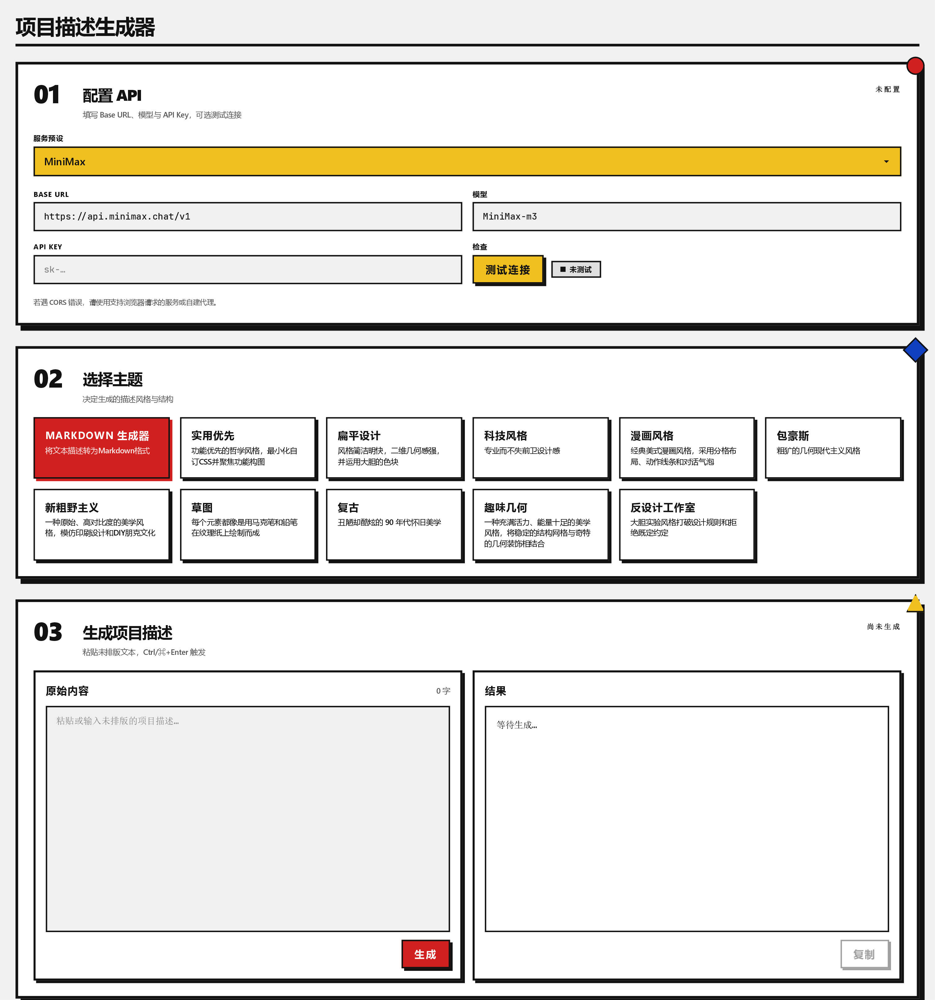
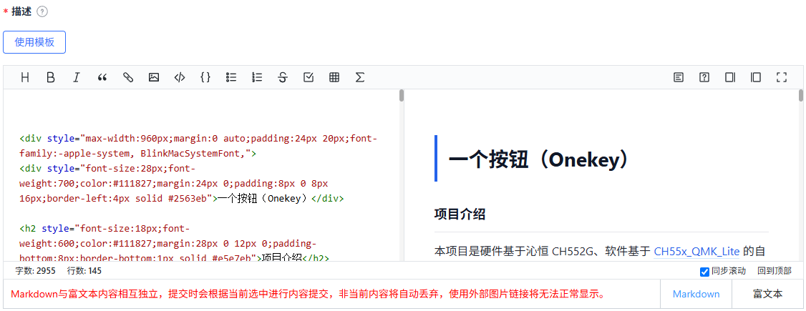

# 项目描述生成器

在 **嘉立创EDA / EasyEDA Pro** 中调用大语言模型美化开源项目描述。

## ✨ 特性

- **多服务商** — 兼容所有 OpenAI 协议的服务商（OpenAI / DeepSeek / 智谱 GLM / MiniMax / Xiaomi MiMo / Anthropic Claude / Google Gemini / SiliconFlow / OpenCode Go / 月之暗面 Kimi 等 10 家服务商预设 + 自定义）
- **主题化排版** — 内置「Markdown」等主题，支持自定义主题提示词
- **本地持久化** — API 配置、主题选择、自定义提示词均通过 `localStorage` 持久化，刷新不丢失
- **响应式布局** — 输入/输出并排双栏，窄屏自动切换为上下单列
- **流式输出与可停止** — 生成中按钮切换为「停止」，点击立即中断 LLM 请求
- **think 折叠与复制过滤** — 自动识别模型 `<think>…</think>` 推理块并折叠；点「复制」只复制正文，不含 think
- **最外层代码围栏剥离** — 自动丢弃 LLM 输出首尾的 markdown 代码围栏，避免污染显示与复制

## 📦 安装

访问 [嘉立创EDA扩展广场](https://ext.lceda.cn/) 下载。

## 🚀 使用

在立创 eda 顶部菜单栏 高级 中打开拓展

### 1️⃣ 配置 API

打开扩展后，先配置大模型API：

| 字段         | 说明                                            |
| ------------ | ----------------------------------------------- |
| **服务预设** | 选择 LLM 服务商（自动填充 Base URL 和默认模型） |
| **Base URL** | API 端点，如 `https://api.openai.com/v1`        |
| **模型**     | 模型名，如 `gpt-4o-mini` / `deepseek-reasoner`  |
| **API Key**  | 服务商提供的密钥                                |
| **测试连接** | 验证配置是否正确（按钮为黄色 Bauhaus 风格）     |

- 模型标识以服务商**当前官方文档**为准，例如 DeepSeek 控制台公布的最新模型名（参考链接）：
    - [Deepseek API 开放平台](https://platform.deepseek.com/api_keys)
    - [Deepseek API 文档](https://api-docs.deepseek.com/zh-cn/)

### 2️⃣ 选择主题

在「**02 选择主题**」步骤中选择排版风格

> 点击主题卡片的 👁 图标可查看/编辑对应的**固定提示词**。
> 主题选中后，固定提示词的修改会保存在 `localStorage` 中，与默认内容不同时标记为"已覆盖"。

### 3️⃣ 生成项目描述

在「**03 生成项目描述**」步骤中：

1. 左侧粘贴未排版的项目描述（支持 Ctrl/⌘+Enter 触发）
2. 点击红色「**生成**」按钮；**生成中按钮变为「停止」**，再次点击可立即中断请求
3. 右侧实时流式显示输出：
    - 若模型先输出 `<think>…</think>` 推理过程，会折叠为「思考中... (X.Xs)」，正文继续在下方流式渲染
4. 生成完成后（流自然结束或点击「停止」），点击底部「**复制**」按钮，仅复制正文内容（自动排除 think 块；自动剥离 LLM 在最外层误加的 markdown 代码围栏）

### 4️⃣ 粘贴项目描述

1. 在开源平台中打开目标项目
2. 在描述编辑器右下角选择“Markdown”，然后将生成的项目描述粘贴进编辑器
3. 保存即可

## 📋 已知限制

- **协议兼容**：仅完整支持 OpenAI 兼容的 `/chat/completions` 协议
    - **Anthropic Claude / Google Gemini** 预设保留在服务商下拉中，但目前仅作为 Base URL / 模型占位；接入 Anthropic 原生 `/v1/messages` 与 Gemini 原生协议需后续实现，使用前请确认目标服务商同时提供 OpenAI 兼容端点
- **CORS**：部分服务商（如官方 OpenAI）拒绝浏览器直接请求，需自建代理或选择支持 CORS 的服务商

## 📘 开发 & 许可

面向开发者的技术文档（架构 / 扩展点 / 开发命令）请参见 **[DEVELOPMENT.md](./DEVELOPMENT.md)**。

本项目使用 [Apache License 2.0](https://choosealicense.com/licenses/apache-2.0/) 开源许可，你可以自由使用、修改、分发本项目。

## 🔗 参考

提示词来自 [designprompts.dev](https://www.designprompts.dev/)
