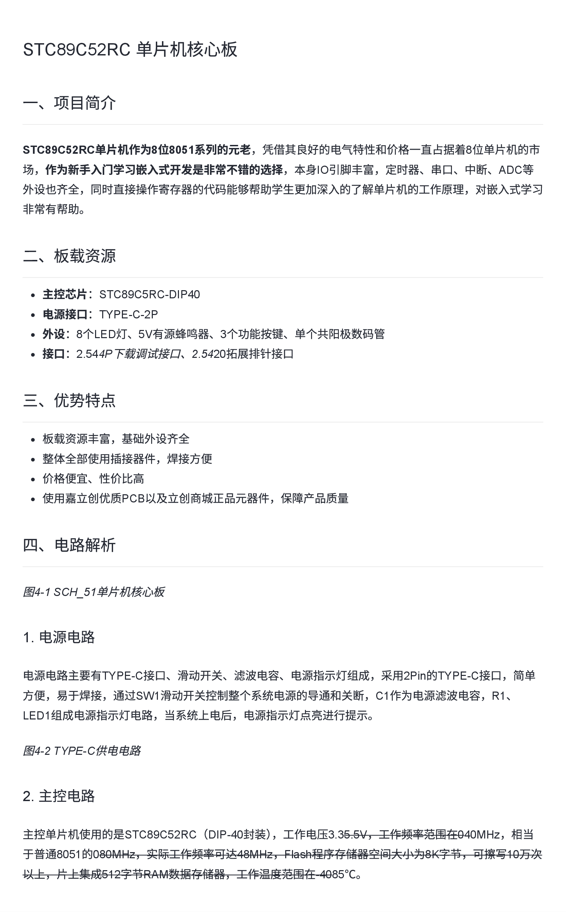
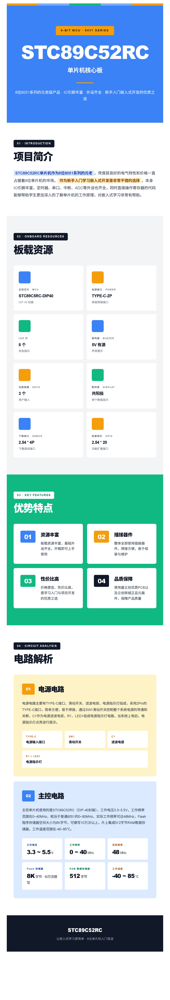
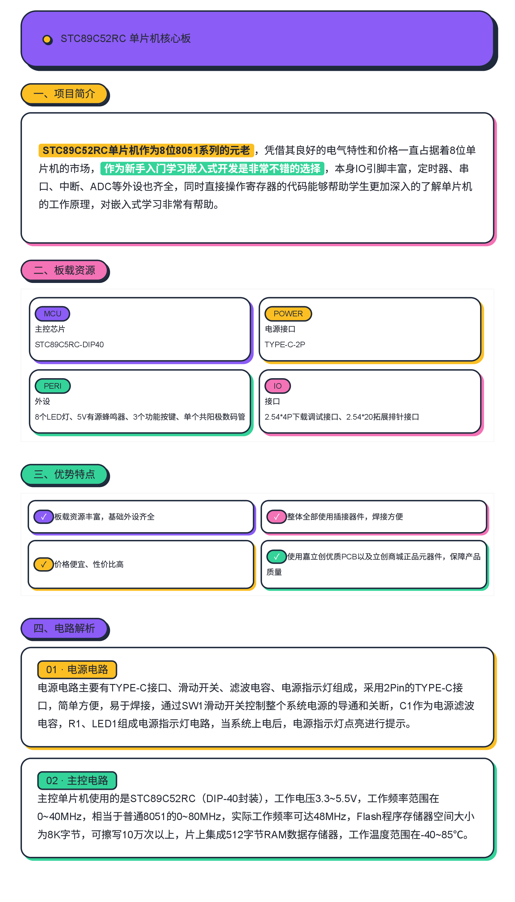
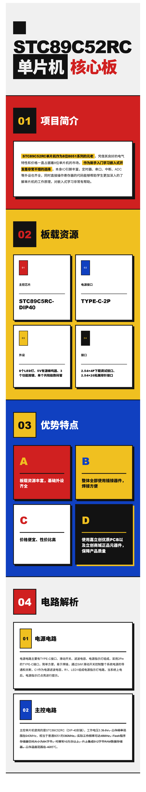
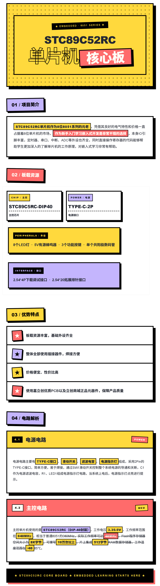
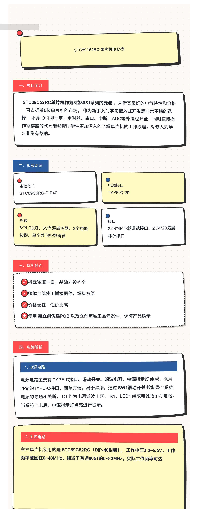
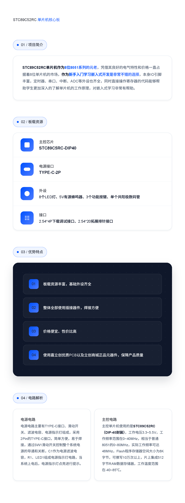
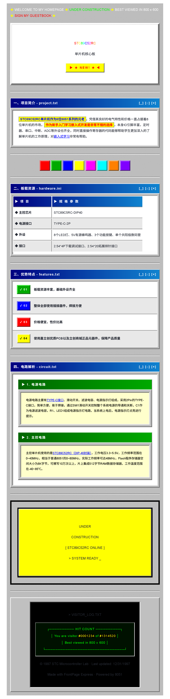

# 项目描述生成器

> 在 **嘉立创EDA / EasyEDA Pro** 中调用大语言模型，把零散的项目笔记一键整理为结构化的 README / 项目描述。

<p align="left">
  
  
  
  
</p>

---

## ✨ 特性

- **流式输出** — SSE 增量渲染，逐 chunk 显示模型输出，无需等待完整响应
- **多服务商** — 兼容所有 OpenAI 协议的服务商（OpenAI / DeepSeek / 智谱 GLM / MiniMax / 通义千问 / 硅基流动 / 月之暗面 Kimi 等 11 家预设）
- **主题化排版** — 内置「Markdown 生成器」等主题，支持自定义系统提示词与固定提示词
- **本地持久化** — API 配置、主题选择、自定义提示词均通过 `localStorage` 持久化，刷新不丢失
- **响应式布局** — 输入/输出并排双栏，窄屏自动切换为上下单列

## 🎨 主题预览

|                                                           |                                              |                                                           |                                             |
| :-------------------------------------------------------: | :------------------------------------------: | :-------------------------------------------------------: | :-----------------------------------------: |
|  <br>**Markdown**  | <br>**扁平设计** | <br>**趣味几何** | <br>**包豪斯** |
| <br>**新粗野主义** |    <br>**草图**    |       <br>**科技风格**        |    <br>**复古**    |

---

## 📦 安装

### 方式一：从扩展商店安装（推荐）

访问 [嘉立创EDA扩展商店](https://ext.lceda.cn/item/moth/) 直接安装。

### 方式二：从源码构建

```bash
# 1. 克隆仓库
git clone https://github.com/kap1bala/project-description-generator.git
cd project-description-generator

# 2. 安装依赖
npm install

# 3. 构建扩展包
npm run build

# 4. 在 EasyEDA Pro 中导入
#    扩展管理 → 本地扩展 → 选择 ./build/dist/*.zip 安装
```

---

## 🚀 使用

### 1️⃣ 配置 API

打开扩展后，在「**01 配置 API**」步骤中：

| 字段         | 说明                                            |
| ------------ | ----------------------------------------------- |
| **服务预设** | 选择 LLM 服务商（自动填充 Base URL 和默认模型） |
| **Base URL** | API 端点，如 `https://api.openai.com/v1`        |
| **模型**     | 模型名，如 `gpt-4o-mini` / `deepseek-reasoner`  |
| **API Key**  | 服务商提供的密钥                                |
| **测试连接** | 验证配置是否正确（按钮为黄色 Bauhaus 风格）     |

### 2️⃣ 选择主题

在「**02 选择主题**」步骤中选择排版风格：

- **Markdown 生成器** — 输出结构化 Markdown（H1/H2/H3、加粗规范）
- **Docusaurus 风格** — 输出带 HTML 模板的页面（标题、面包屑、分隔符、卡片）

> 点击主题卡片的 👁 图标可查看/编辑对应的**固定提示词**。
> 主题选中后，固定提示词的修改会保存在 `localStorage` 中，与默认内容不同时标记为"已覆盖"。

### 3️⃣ 生成项目描述

在「**03 生成项目描述**」步骤中：

1. 左侧粘贴未排版的项目描述（支持 Ctrl/⌘+Enter 触发）
2. 点击红色「**生成**」按钮（Bauhaus 几何风格）
3. 右侧实时流式显示输出：
    - 如果模型先输出 `<think>` 推理过程，会折叠为「思考中... (X.Xs)」
    - 思考结束自动展开成可折叠块
    - 推理模型（DeepSeek-R1 / Kimi-Reasoning）建议展开查看完整思考
4. 点击底部「**复制**」按钮，自动剔除 `<think>` 块复制纯正文

---

## 🏗️ 架构

```
project-description-generator/
├── src/                            # EasyEDA 扩展入口
│   └── index.ts                    # 打开 iframe 窗口（1280×800）
├── iframe/                         # 工具 UI（独立可运行）
│   ├── index.html                  # 主页面（Bauhaus 视觉）
│   ├── styles/                     # CSS（Bauhaus 设计系统）
│   │   ├── tokens.css              # 设计令牌（色板 / 圆角 / 阴影 / 字体）
│   │   ├── base.css                # 全局选择器 + 滚动条 + focus
│   │   ├── layout.css              # 顶层布局 + step / pane 几何
│   │   └── components.css          # 按钮 / 输入 / 输出 / 模态框 / 装饰
│   ├── modules/
│   │   ├── app.js                  # 入口
│   │   ├── prompts/                # 系统 / 主题 / 固定提示词数据
│   │   ├── services/
│   │   │   ├── llm/client.js       # LLM 流式调用（SSE）
│   │   │   ├── providers-data.js   # 11 家服务商预设
│   │   │   └── storage.js          # localStorage 封装
│   │   └── ui/                     # 面板组件
│   │       ├── config-panel.js     # API 配置面板
│   │       ├── input-panel.js      # 输入框
│   │       ├── output-panel.js     # 输出框 + think 折叠 + 复制过滤
│   │       ├── theme-selector.js   # 主题胶囊单选
│   │       ├── theme-detail-modal.js # 主题详情 / 固定提示词编辑
│   │       └── toast.js            # 轻量提示
│   └── dist/bundle.js              # esbuild 打包产物（IIFE）
├── config/                         # esbuild 配置
├── build/                          # 打包为 zip
└── extension.json                  # EasyEDA 扩展清单
```

### 关键设计

- **流式调用**：`client.js:generate()` 用 `fetch + getReader()` 解析 SSE 协议（`data: {...}\n\n`），每 `delta.content` 通过 `onChunk` 回调推给 UI
- **think 状态机**：`output-panel.js` 内置 OUT / IN_THINK 状态切换，跨 chunk 容错（半截 tag 缓存到下次），遇到 `</think>` 自动停止
- **HTML 标签归一化**：`<p style="...">` 内的连续空白（换行/缩进空格）压成单空格，避免模型把单行 HTML 拆成多行
- **Bauhaus 设计系统**：`tokens.css` 单一来源，硬阴影（4-8px → black 0 模糊）、thick black borders（2-4px）、二元圆角（0 / 9999px）、primary 色板（红 #D02020 / 蓝 #1040C0 / 黄 #F0C020）

---

## ✏️ 自定义主题与提示词

### 添加新主题

编辑 `iframe/modules/prompts/themes-data.js`：

```js
{
    id: 'my-theme',
    name: '我的主题',
    description: '一句话说明',
    fixedPromptId: 'byHtmlTemplate',  // 或 'empty'
    prompt: `# 系统提示词
具体排版规则...
`,
}
```

### 添加新固定提示词

编辑 `iframe/modules/prompts/fixed-prompts-data.js`：

```js
{
    id: 'my-fixed',
    name: '我的固定提示词',
    description: '简要说明',
    content: '强制约束的提示词内容...',
}
```

修改后需重新打包：

```bash
npm run compile-iframe
```

---

## 🛠️ 开发

### 命令

| 命令                     | 作用                                                |
| ------------------------ | --------------------------------------------------- |
| `npm run compile`        | 编译主扩展（`src/index.ts`）                        |
| `npm run compile-iframe` | 编译 iframe 模块（`iframe/modules/*`）              |
| `npm run build`          | 完整构建（`compile` + `compile-iframe` + 打包 zip） |
| `npm run prettier:all`   | 格式化全部代码                                      |
| `npm run eslint:all`     | ESLint 检查 TS 代码                                 |
| `npm run fix`            | prettier + eslint 一次性修复                        |

### 技术栈

- **TypeScript** — 扩展入口 `src/index.ts`
- **Vanilla JS**（无框架）— iframe 内 `iframe/modules/*`
- **esbuild** — 模块打包（IIFE 模式）
- **Husky + lint-staged** — 提交前自动 prettier + eslint
- **CSS** — 自定义 Bauhaus 设计系统（无 Tailwind / shadcn）

### 本地预览

```bash
# 启动静态服务器预览 iframe UI
npx serve iframe/

# 或在 EasyEDA Pro 中加载 ./build/dist/*.zip
```

---

## 📋 已知限制

- **协议兼容**：仅支持 OpenAI 兼容 `/chat/completions`，Anthropic / Gemini 原生协议未实现
- **CORS**：部分服务商（如官方 OpenAI）拒绝浏览器直接请求，需自建代理或选择支持 CORS 的服务商
- **iframe 高度**：EasyEDA iframe 初始窗口 1280×800，可最大化；输入/输出框固定 480px 高度独立滚动
- **超时**：默认 10 分钟（`GENERATE_TIMEOUT_MS` in `client.js`），长生成任务可调大

---

## 🤝 贡献

欢迎提交 Issue / PR

---

## 📄 许可

本项目使用 [Apache License 2.0](https://choosealicense.com/licenses/apache-2.0/) 开源许可。

你可以自由使用、修改、分发本项目。

---

## 🔗 相关链接

- [嘉立创EDA 扩展开发文档](https://prodocs.lceda.cn/cn/api/guide/)
- [嘉立创EDA 扩展商店](https://ext.lceda.cn/)
- [pro-api-sdk（基础 SDK）](https://github.com/easyeda/pro-api-sdk)
